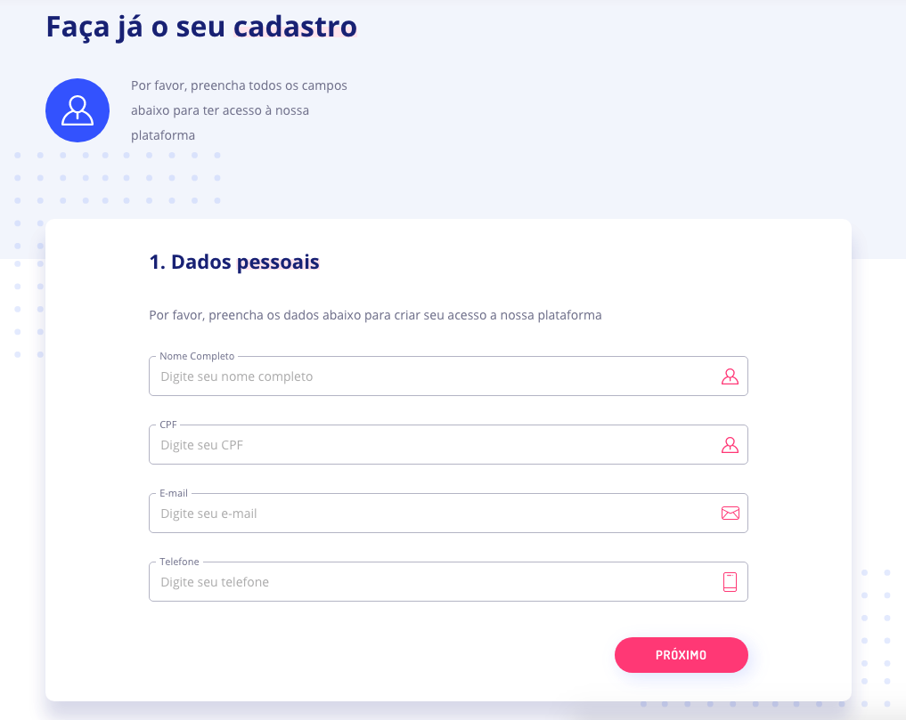

# Antes de começar

## Informações importantes

Para utilizar nossa API em produção é necessário que se entre com contato com [onboard@qitech.com.br](mailto:onboard@qitech.com.br) para contato comercial e configuração da integração. Nessa etapa são definidos:

- **FIDC que irá comprar essa dívida**: atualmente, restrições regulatórias de quem pode comprar a dívida emitida.
- **URL de Callback**: Endereço o qual os webhooks devem ser enviados.
- **Envio de um identificador de integração**: UUID que identifica sua integração.
- **Troca de chaves de assinatura**: para autenticação (mais em [AUTENTICAÇÃO E SEGURANÇA](?file=221)).

Para fins de testes em nosso ambiente de sandbox basta criar seu cadastro no ambiente e fazer a troca das chaves.
Abaixo explicaremos como realizar seu cadastro.

## 1. Crie sua conta em nosso ambiente de sandbox

Para começar, acesse o [nosso ambiente sanbox](https://sandbox.qitech.com.br/register) e siga todos os passos 
para iniciar a criação da sua conta.



## 2. Faça a troca das chaves

Toda a troca de informações entre APIs deverá utilizar o protocolo HTTPS[¹](#1) e uma assinatura  assimétrica[²](#2). Nosso modelo de implementação da assinatura é baseado no utilizado pela Amazon[³](#3), sendo a principal diferença o uso de chaves assimétricas que adicionam uma camada de não-repúdio na comunicação.

Toda a comunicação com a QI é assinada, tanto as requisições quanto as respostas, isso significa que existe um parâmetro nas mensagens que garante sua autenticidade. Para realizar tal assinatura, a QI usa um padrão com chaves assimétricas, portanto existem duas chaves diferentes, uma para assinatura (chave privada) e uma para leitura (chave pública). As assinaturas seguem o padrão JWT[⁴](#4) e o algoritmo de criptografia ECDSASHA512[⁵](#5) (Recomendamos **FORTEMENTE** a exploração do site https://jwt.io/, nele você conseguirá validar JWTs e descobrir bibliotecas para lidar com esses tokens em basicamente qualquer linguagem moderna de programação).

O uso dessa combinação de tecnologias visa criar um canal de comunicação seguro e que garanta que as mensagens enviadas só poderiam vir de uma fonte que possui a chave privada para assiná-la. Por esse motivo o par de chaves pública-privada precisa ser criado de maneira independente por cada uma das partes e a chave privada deve ser guardada em segredo, não sendo divulgada para nenhum terceiro ou parte interessada, nem mesmo a QI.

## 2.1 Gerando suas chaves pública e privada

Para gerar uma chave pública em um computador UNIX faça:

```bash
$ ssh-keygen -t ecdsa -b 521 -m PEM -f jwtECDSASHA512.key
```

E a partir desta chave privada gere sua chave pública.

```bash
$ openssl ec -in jwtECDSASHA512.key -pubout -outform PEM -out jwtECDSASHA512.key.pub
```

# 2.2 Gerando a chave pública e de integração da QI Tech

Como parte da assinatura das requests e das respostas é necessário que você forneça sua chave pública a nós e que nós forneçamos uma chave pública para você, assim a leitura das mensagens poderá ser feita nas duas pontas da comunicação. Além disso forneçemos uma chave única do tipo UUID que representa sua integração via API dentro de nosso sistema.

Para receber as duas chaves faça login na [plataforma QI Tech no ambiente sandbox](sandbox.qitech.app/). Clique em "Meu perfil", localizado no menu lateral esquerdo, depois entre na aba Integração. Após isso, insira sua chave pública no primeiro campo e clique no botão “SALVAR CHAVE”. Feito isto a chave pública e de integração da QI Tech estarão disponíveis nos campos inferiores.

**ATENÇÃO:** Nunca forneça sua chave privada, ela é de uso exclusivo seu e o compartilhamento da mesma no lugar da chave pública compromete a segurança de suas requests. Além disso, não compartilhe suas chaves públicas QI Tech e chave de integração pois eles são seu
meio de comunicação com nossas APIS.

<sub>
<sub>
<br>
1<a id=1></a>: Para encriptação da comunicação
<br>
2<a id=2></a>: Para autenticação e não-repúdio da informação
<br>
3<a id=3></a>: Literatura sugerida: Signing HTTP messages (https://datatracker.ietf.org/doc/draft-cavage-http-signatures/), Security Considerations for HTTP Signatures (https://web-payments.org/specs/source/http-signatures-audit/) e AWS Signing and Authenticating REST Requests (https://docs.aws.amazon.com/AmazonS3/latest/dev/RESTAuthentication.html)
<br>
4<a id=4></a>: JWT (JSON Web Token): https://jwt.io/
<br>
5<a id=5></a>: Exemplo de geração de chaves em um computador UNIX:
<br>
</sub>
</sub>


